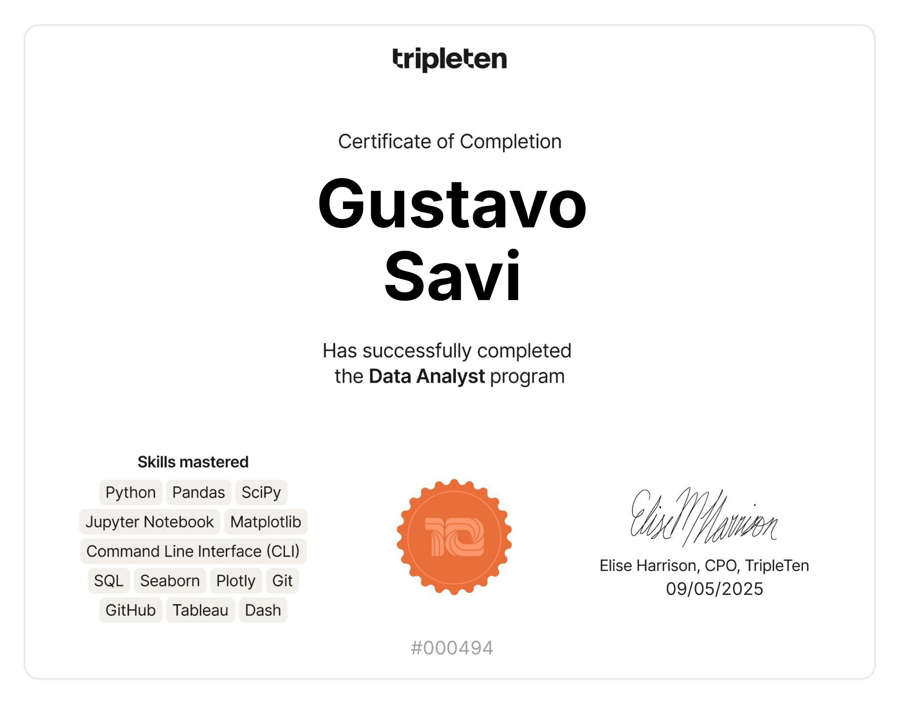
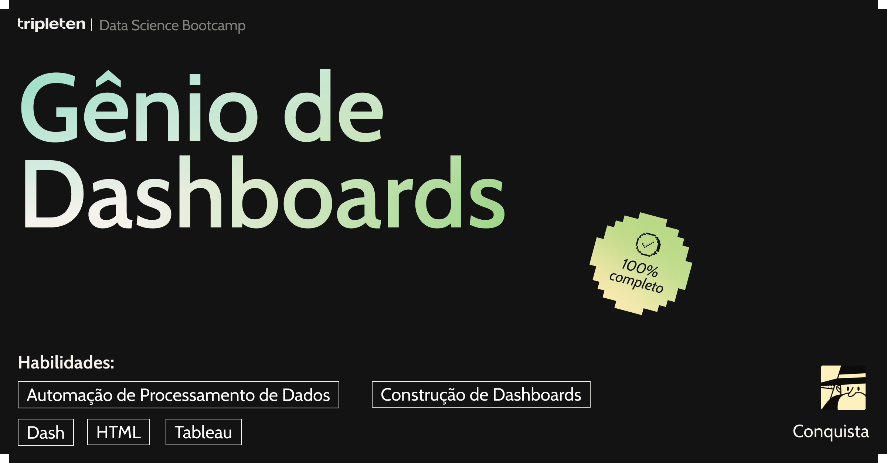

# Olá! Eu sou o Gustavo Savi

**Junior Data Analyst | Former Engineer AI**  
Diretor e gestor em uma empresa de educação de trânsito | 🎓 Formado em Análise de Dados pelo bootcamp da TripleTen e Data Science Academy

---

Sou Gustavo Savi, Analista de Dados Júnior, atualmente atuando como diretor e gestor em uma empresa da área de trânsito.
Minha experiência liderando equipes, processos e estratégias operacionais despertou meu interesse em usar dados e automação inteligente para otimizar decisões e resultados — e foi assim que começou minha jornada no mundo da Análise de Dados e Inteligência Artificial.

Durante o bootcamp intensivo da TripleTen, desenvolvi projetos práticos aplicando Python, SQL, Pandas, NumPy e Matplotlib para resolver problemas reais.
Tenho experiência com dashboards no PowerBI, Tableau, ETL, data storytelling e análises orientadas à tomada de decisão.

Atualmente, venho expandindo meus estudos para o campo da IA aplicada à Análise de Dados, explorando temas como:
- LLMs (Modelos de Linguagem de Grande Escala)
- Automação e Agentes de IA (Agno, LangChain, LangGraph)
- Integração entre análise de dados e soluções baseadas em IA

Busco oportunidades como Analista de Dados Júnior ou Estagiário em Data Analytics, onde possa combinar minha visão estratégica de gestão com a aplicação prática de dados e automação inteligente.

---

## 🏆 Conquistas e Certificações

### Certificado do Bootcamp em Análise de Dados | TripleTen
* **Habilidades Demonstradas:** Análise de dados, Python (Pandas, NumPy, Matplotlib), SQL, visualização de dados (Tableau), Machine Learning, testes A/B.

---

### Conquistas

* **SQL para Análise de Dados:** 
  _Curso de SQL realizado junto à Data Science Academy._
* **Analista de Dados Aspirante:** 
  _Depois de algumas semanas de estudo, desenvolvi habilidades típicas de um analista de dados._
* **Coleção e Armazenamento de dados (SQL):** 
  _Habilidades desenvolvidas com banco de dados complexos usando SQL._
* **Construção de Dashboards:** 
  _Habilidades na criação de dashboards vinculados a banco de dados._
* **Guru de Decisões de Negócios:** 
  _Através dos testes de hipóteses (testes A/B), desenvolvi habilidades para tomada de decisões baseadas em dados._
* **Narrando Dados:** 
  _Desenvolvimento de excelentes visualizações de dados, adquirindo habilidades em seaborn e plotly._

---
  
## 🧰 Tecnologias e Ferramentas

---

## 📊 Meus Projetos

🗂️ Aqui no meu perfil você encontra projetos desenvolvidos no bootcamp e outros pessoais, com foco em:

- Análise exploratória e visualização de dados
- Estudo de comportamento do usuário e rotatividade de clientes
- Testes A/B com análise estatística
- Dashboards e storytelling com dados
- Alguns apps streamlit, dentre eles um utilizando OpenAI

👉 Dê uma olhada nos meus repositórios para saber mais sobre cada um deles!

---

## 📬 Como me encontrar

- ✉️ E-mail: [gutosavi@hotmail.com](mailto:gutosavi@hotmail.com)  
- 🔗 [LinkedIn](https://www.linkedin.com/in/gustavo-savi)  
- 📂 [GitHub](https://github.com/gutosavi)  
- 🌐 [Facebook](https://www.facebook.com/gustavo.savi.5)

---

## 😄 Fun Facts

- Sempre aprendendo algo novo sobre dados!
- Desenvolvendo um grande interesse no mundo da IA!
- Sobrevivente oficial à base de café.
- 🚴‍♂️ Às vezes, troco os dados pela bike. (Strava vibes 😎)

---

Se algum projeto te interessar, deixa uma ⭐ por lá — isso me ajuda a crescer e evoluir!  
Obrigado por visitar meu perfil!

