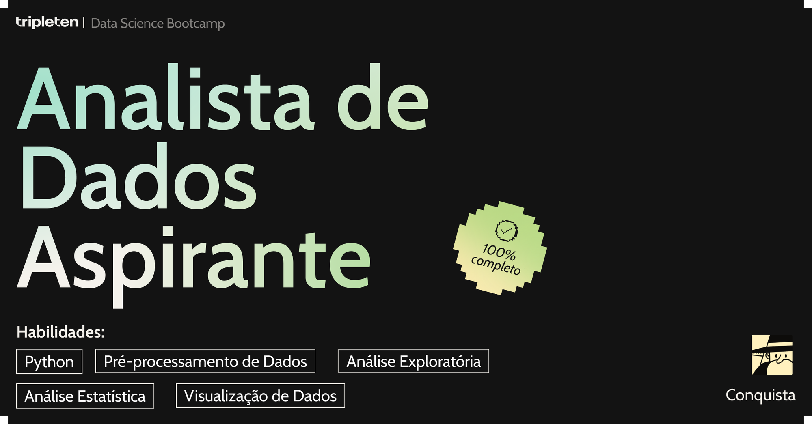

# 👋 Olá! Eu sou o Gustavo Savi

🎯 **Data Analyst in Career Transition**  
🚗 Diretor e gestor em uma empresa de educação de trânsito | 🎓 Formado em Análise de Dados pelo bootcamp da TripleTen

---

Sou Gustavo Savi, Analista de Dados em transição de carreira, atualmente atuando como diretor e gestor em uma empresa na área de trânsito. Minha experiência liderando processos administrativos, equipes e estratégias operacionais me despertou o interesse em usar dados como ferramenta para otimizar decisões e resultados — e foi assim que comecei minha jornada no mundo da Análise de Dados.

Me formei no bootcamp intensivo da TripleTen, onde desenvolvi projetos práticos aplicando Python, SQL, Pandas, NumPy e Matplotlib para resolver problemas reais. Tenho experiência com dashboards no Tableau, ETL, data storytelling e análises orientadas a tomada de decisão baseada em dados.

Busco oportunidades como Analista de Dados Júnior ou Estagiário em Data Analytics, onde possa aplicar minha experiência de liderança com uma visão analítica estratégica e seguir crescendo na área de dados.

🔍 **Em busca de oportunidades como Analista de Dados Júnior ou Estagiário em Data Analytics**.

---

## 🏆 Conquistas e Certificações

### Certificado do Bootcamp em Análise de Dados | TripleTen
* **Habilidades Demonstradas:** Análise de dados, Python (Pandas, NumPy, Matplotlib), SQL, visualização de dados (Tableau), Machine Learning, testes A/B.

---

### Conquistas

* **Analista de Dados Aspirante:** 
  _Depois de algumas semanas de estudo, desenvolvi habilidades típicas de um analista de dados._
* **Certificação SQL:** 
  _Habilidades desenvolvidas com banco de dados complexos usando SQL._
* **Construção de Dashboards:** 
  _Habilidades na criação de dashboards vinculados a banco de dados._
* **Guru de Decisões de Negócios:** 
  _Através dos testes de hipóteses (testes A/B), desenvolvi habilidades para tomada de decisões baseadas em dados._
* **Narrando Dados:** 
  _Desenvolvimento de excelentes visualizações de dados, adquirindo habilidades em seaborn e plotly._

---
  
## 🧰 Tecnologias e Ferramentas

---

## 📊 Meus Projetos

🗂️ Aqui no meu perfil você encontra projetos desenvolvidos no bootcamp e outros pessoais, com foco em:

- Análise exploratória e visualização de dados
- Estudo de comportamento do usuário e rotatividade de clientes
- Testes A/B com análise estatística
- Dashboards e storytelling com dados

👉 Dê uma olhada nos meus repositórios para saber mais sobre cada um deles!

---

## 📬 Como me encontrar

- ✉️ E-mail: [gutosavi@hotmail.com](mailto:gutosavi@hotmail.com)  
- 🔗 [LinkedIn](https://www.linkedin.com/in/gustavo-savi)  
- 📂 [GitHub](https://github.com/gutosavi)  
- 🌐 [Facebook](https://www.facebook.com/gustavo.savi.5)

---

## 😄 Fun Facts

- 🧠 Sempre aprendendo algo novo sobre dados!
- ☕ Sobrevivente oficial à base de café.
- 🚴‍♂️ Às vezes, troco os dados pela bike. (Strava vibes 😎)

---

Se algum projeto te interessar, deixa uma ⭐ por lá — isso me ajuda a crescer e evoluir!  
Obrigado por visitar meu perfil!

